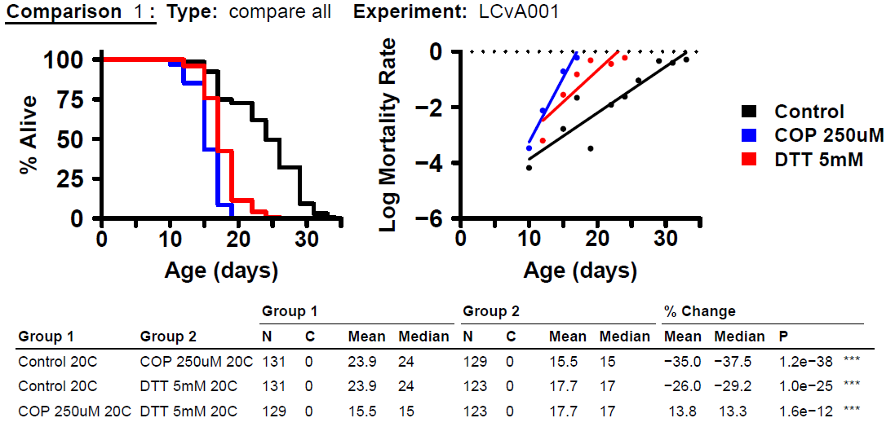

```{r setup, echo=FALSE}
knitr::opts_chunk$set(fig.pos = "H", out.extra = "", tidy.opts = list(width.cutoff = 60), tidy = TRUE)
```

## Executive Summary

Bradford Hull is a 5th year PhD Student in Molecular and Cellular Biology. He is currently researching lifespans of Caenorhabditis elegans worms and the effects of  different stressors for worms living in different media. Part of his research goal is to perform statistical analyses to determine whether any of these stressors have significant effects on the lifespans of the worms, both within media (compared to a control) and between media for the same stressors. He is primarily interested in comparisons of the same stressors between media for his research.

By the time of our consultation, Bradford had already performed experiments and collected data for both agar and liquid media, using copper and DTT (dithiothreitol) as stressors. Due to some challenges unique to each media, he was not able to perform the same procedure to capture data for each media. 

Bradford was able to provide his data in Excel for our review. The agar media experiments were performed in a manner suitable for the framework of Kaplan-Meier and Log-rank test methods for lifespan analysis, which he has already successfully performed using the `survival` package in $R$. However, his data collection for the liquid media experiments required a different procedure that we determined was not suitable for the Kaplan-Meier analysis framework, and the desired statistical analyses would require a different approach.

Based on the experimental procedure for liquid media of random sampling at time steps, we recommend using the proportion data to generate estimated empirical CDF curves, from which estimated survival curves can be generated for qualitative comparisons of treatments within media. The sampling methods provide unbiased estimates of the population proportions at each time step, so they are reasonable estimates of the curves and reasonable for qualitative analysis. 

However, we cannot recommend any direct media-to-media comparisons, as the procedure for this data collection violates a required assumption that all individuals in the study must be evaluated at each time step until an event (death or censoring). 

We recommend using the estimated empirical CDF and survival curves for approximate comparisons between the two media. Specifically, we suggest comparing the Kaplan-Meier curve for the agar data with the estimated survival curve for the liquid data, providing a clear visual comparison of survival trends.

## **Detailed Summary**

### **1. Background**

Bradford is seeking statistical consultation to help him determine how to adequately approach a statistical analysis for data which he has already captured from several experiments. His research intent is to study the effects of different stressors on the lifespans of worms living in different media, and to compare how the same stressors in different media affect the lifespans of worms. Ultimately this research should aid in generalizing protocol for research using Caenorhabditis elegans as test subjects.

During our consultation, he was able to describe in detail the procedures that were carried out.  First, agar experimental units were made by adding $N=40$ worms to 9 total agar plates. Stressors, copper and DTT (dithiothreitol), were then added to plates.In total there were three plates for each stressor, as well as 3 control cultures in agar media. The $N=40$ and three replicates were chosen based on a power analysis from within the MCB department, but no further details were provided.

Next, liquid experimental units were made by adding approximately $N \approx 5000$ worms to each of three replicate liquid reservoirs per stressor; in total 9 liquid culture reservoirs were prepared. 

It is important to note that all worms were originally drawn from the same population batch of eggs, and that all experimental units were prepared at the same time (same day).

Ultimately, Bradford's goals for analysis are the following (in his words, taken from a follow up email statement).

+ "...determine if the liquid data can be fit into a K-M curve (and therefore be able to use the log-rank test on it)"
+ "...determine if liquid copper and DTT are different from liquid control"
+ "determine if lifespan reductions for both copper and DTT from goal 2 are different from lifespan reductions in the agar data"

The team agreed that our next steps would be the following.

+ Analyze whether the Kaplan-Meier (K-M) procedure is appropriate
  + Within media by stressor
  + Between media by analogous stressor
+ Determine what conditions need to be met for a valid K-M analysis, and if those conditions cannot be met, what approach do we recommend for analysis?

### **2. Methods**

The study began the day the experimental units were prepared, and all worms were alive at the start time step. At every time step (usually one or two days), all experimental units had data collected. However, the procedure for data collection was not the same between experimental units in agar media and units in liquid media.

#### **Agar**

At each timestep, each agar culture sample was able to be observed in its entirety, that is all of the original $N=40$ worms in each sample could be observed, and the number of dead worms were counted. In this sense, individual worms were tracked throughout each timestep of the study, which is an important condition for Kaplan-Meier lifespan analysis. It is worth noting that each of the three replicates are in separate plates, and no worms were able to escape. Each experimental unit's data was recorded until all worms in their respective units were deceased.

#### **Liquid**

Due to challenges with measurement/observation of the worms in liquid media, the experimental procedure did not allow for the observation of the same worms. At each time step, one sample of approximately $150\mu \text{L}$ was drawn from each separate replicate and raw numbers of dead/alive worms were assessed using special lab equipment. Each sample captured approximately 90 worms, and Bradford's procedure of extraction with a pipette reasonably randomized the samples. After data collection these worms were discarded. Based on the data, each experimental unit's data was recorded until there were two consecutive measurements of all-dead worms.

An aside note, we had concerns of worms possibly decaying/dissolving before they could be sampled if they died before they were sampled. Per Bradford, "...There was little to no degradation of dead worms and worms only eat bacteria, so once they died they just floated around and were able to be sampled until the end of the experiment". So, all deceased worms are assumed to be availabe for sample throughout the length of the experiment.

### **3. Results and Evaluation**

Three separate full experiments using the 9 experimental units (three treatments and three replicates) were performed between January and June 2024. A new experiment wouldn't be started until a previous was completed, so there was no overlap between studies. Each experiment lasted approximately a month.

#### **Agar**

The experimental procedure for agar media captures time-to-event data (the event in question being death) for all individual worms throughout the length of the study. Observations were of the same individual worms in each experimental unit at every time step. Time steps were generally once every two days, excluding weekends, but in all cases all units were sampled at each time step. @goel mentions that an event can happen between time steps, and that more frequent observations may be needed to improve accuracy, but does not imply that this is an issue for the data beyond some estimation inaccuracies.

All experimental units were sampled until every worm was dead, and no worms escaped any of the experimental units, so there are no cases where censoring is required of any of the subjects' data. We have adequate conditions for a Log-rank test since all subjects were observed for the length of the study until all died, and we have complete survival functions $S(t)$ for comparison. This comparison is only valid within the agar media and between treatments. We are able to use an empirical CDF $F_n(t)$ to estimate the survival functions. A Kaplan-Meier analysis would only technically be necessary to account for any censored data, so it is not necessary here (although its survival curve is very similar).

The analyses that Bradford performed of the data using the `survival` package in R are valid for comparisons between treatments *within each agar media replicate*. Pooling the three replicates for analysis can be justified given that the below assumptions are valid, and they should be confirmed to be reasonable by Bradford for validity.

+ All replicates have identical treatment conditions.
+ Survival times are independent between subjects.
+ Pooled analyses must maintain these same assumptions.

Below are the analyses that were provided by Bradford for reference.

```{r, echo=FALSE, warning=FALSE}
library(knitr)
library(formatR)
path = "C:/Users/Alex Salce/OneDrive/Desktop/School/Courses/2024 FALL SDS MS/STAT 688AB STATISTICAL CONSULTING/repo/statistical-consulting/Bradford Hull"
```

```{r agar-figures-side, fig.margin=TRUE, fig.show='hold', fig.align='center', fig.cap="Agar survival analyses by experiment (pooled replicates)", out.width="30%", echo=FALSE}

include_graphics("LC003survival.png")
include_graphics("LC004survival.png")
```

```{r agar-pooled, fig.margin=TRUE,fig.cap="Agar survival analyses (all experiments pooled)", out.width="50%", fig.align='center', echo=FALSE}
include_graphics("pooledsurvival.png")
```

#### **Liquid**

The experimental procedure for the liquid media does not capture time-to-event data as would be required for a similar analysis as the  agar media. This method uses a random sample draw from the experimental unit population without replacement at each time step, and can only observe the sampled worms at that time step.

It should be noted that his method for extraction could reasonably be considered a simple random sample, and thus each data record is an unbiased estimate of the distribution of the population within each replicate at each time step.

Still, K-M and Log-rank test analyses require that "...the event happens at the time specified" (@goel), meaning that all subjects must be monitored for the entire length of the experiment. For this random sampling procedure, we cannot say whether or not any of the sampled dead worms were alive at the previous time step, nor any preceding time step. Consequently, a traditional Kaplan-Meier analysis is not valid for this data.

We do note that the random samples are representative of the distribution of the population within each experimental unit at each time step. As stated above, each sample is an unbiased estimate of the population at that timestep, which can be taken into consideration for qualitative analyses.

### **Recommendations**

The discrepancies between measurement methods for each media are not trivial, and do not fit the framework for any of the analyses we have seen thus far. Below are some recommended approaches for analysis.

#### **1. Estimated survival curves and empirical CDF for liquid media**

A non-parametric analysis can be recommended using the estimated empirical CDF for the liquid media data, understanding that the following assumptions about the data are required for the empirical CDF to be valid.

+ Observations are independent
+ Samples are identically distributed

Independence of observations can be justified at the discretion of the researcher; the sample population from which samples are drawn must be large enough that subsequent draws are not impacted. If $N \approx 5000$ worms in the sample can be considered reasonably large as to not be impacted by sampling without replacement, the independence assumption is reasonable. The sample draws are all from the same overall population distribution, approximately, so the second assumption should be approximately reasonable.

For the liquid media replication 1 of experiment 1, we calculated the survival probabilities and plotted the estimated survival curves and empirical CDF (See R code in appendix).  The survival ratio was calculated as the ratio of alive worms to the total worms for each treatment at each time point.  Cumulative survival probabilities were derived as the product of survival ratios over time for each treatment. The cumulative proportion of dead worms was then computed as 1 minus the survival probability for each treatment. This results in an estimate for the survival function that is using unbiased population proportion estimates (a result of simple random sampling) at each time step $t$.
\[
\hat{S}(t) = 1-\hat{F}_{n}(t)
\]
Where $\hat{S}(t)$ is the estimated survival curve and $\hat{F}_n(t)$ is the estimated empirical CDF.

##### **Estimated Empirical Cumulative Distribution Function (ECDF)** 

The Estimated ECDF diagrams plot $\hat{F}_n(t)$, and would be used to visualize the cumulative mortality.

```{r, fig.margin=TRUE, fig.show='hold', fig.cap="ECDF Curve", fig.align='center', out.width="100%", echo=FALSE}

```

##### **Estimated Survival curves** 

The estimated survival plots of $\hat{S}(t)=1-\hat{F}_n(t)$ are included as they are analogous to the survival curves we visualized for the agar data.

There is a clear qualitative difference between DTT and the copper and control groups in time until events. It is possible there is difference between control and copper, however we cannot ascertain whether that is the case from this analysis alone.


```{r, fig.margin=TRUE, fig.show='hold', fig.cap="Survival Curve", fig.align='center', out.width="100%", echo=FALSE}

```


#### **2.Median lifespan comparisons**

Median lifespans may be of interest for qualitative comparisons of the survival functions. We can estimate the median lifespan time for each treatment from the survival curves by identifying the time point where the survival probability crosses 0.5. The median time is around 7 days for DTT, 21 days for control, and 23 days for copper in replicate 1 of experiment 1, so the median time follows the order: DTT < Control < Copper. $R$ Code to add median values to plot is included in the appendix

Comparing the median time between liquid and agar: In agar media, based on the survival curves, the median time is Copper < DTT < Control, which is different from the order in liquid media.

```{r, fig.margin=TRUE, fig.show='hold', fig.cap="Survival Curve with medians", fig.align='center', out.width="100%", echo=FALSE}

```

```{r, fig.margin=TRUE, fig.show='hold', fig.cap="ECDF Curve with medians", fig.align='center', out.width="100%", echo=FALSE}

```

### **4. Recommended further study**

We recommend running a similar analysis as in replicate 1, and plot the survival curves and empirical CDF for replicates 2 and 3, as well as for experiments 2 and 3. Similar comparisons can be made between media.

There is still worthwhile information in the qualitative comparisons between media based on these results, however all caveats as outlined in this report should be disclosed and utilized at the discretion of the researchers. 


### **Appendix**

#### **1. Kaplan-Meier assumptions  **

-- Survival time: The survival time must be accurately measured for each individual in the population from the start of the study until an event (death or censoring).

-- Censoring: Censoring must be non-informative, meaning it's unrelated to the outcome of interest.

-- Survival probabilities: Survival probabilities should be the same for people recruited early or late in the study.

-- Event occurrence: The time of the event must be available, and should not have occurred in between observations.  

#### **2. Empirical CDF assumptions **

-- Independence: Observations must be independent.

-- Identically Distributed: Observations should be assumed to be coming from the same underlying distribution.

-- No assumptions about underlying distribution, as it is a non-parametric method.

-- Samples should be representative of population distribution.

#### **3. R code**

----------------------------------------

```{r setup_environment, message=FALSE, tidy=TRUE, tidy.opts=list(width.cutoff=60), warning=FALSE, eval=FALSE}
# Load library
library(ggplot2)
library(latex2exp)
library(tidyr)
library(dplyr)
# Read in the experiment 1 data file
data <- read.csv("C:/Bradford Hull/Liquid_experiment1.csv", header = TRUE)
# Calculate survival ratios, survival probabilities, and cumulative proportion
# of dead for replicate 1
data <- data %>%
        mutate(
               control1_SRatio = Control1_Alive / (Control1_Alive + Control1_Dead),
               control1_SProb  = cumprod(control1_SRatio),
               control1_CDead  = 1 - control1_SProb,
    
               copper1_SRatio  = Copper1_Alive / (Copper1_Alive + Copper1_Dead),
               copper1_SProb   = cumprod(copper1_SRatio),
               copper1_CDead   = 1 - copper1_SProb,  
    
               dtt1_SRatio     = DTT1_Alive / (DTT1_Alive + DTT1_Dead),
               dtt1_SProb      = cumprod(dtt1_SRatio),
               dtt1_CDead      = 1 - dtt1_SProb)

# Add a row for Day 0 where all survival probabilities are 1 and all 
# cumulative proportion of dead is 0
day_0 <- data.frame(
                    Day = 0,
                    control1_SProb = 1,
                    copper1_SProb = 1,
                    dtt1_SProb = 1,

                    control1_CDead = 0,
                    copper1_CDead = 0,
                    dtt1_CDead = 0)
# Add this row to the original data
data <- bind_rows(day_0, data) %>%
        arrange(Day)
# Data for plotting survival curves
data_SProb <- data %>%
              select(Day, control1_SProb, copper1_SProb, dtt1_SProb) %>%
              gather(key = "Treatment", value = "Survival_Prob", -Day) %>%
              mutate(Treatment = recode(Treatment, 
                            "control1_SProb" = "Control", 
                            "copper1_SProb" = "Copper", 
                            "dtt1_SProb" = "DTT"))

# Calculate medians for each treatment
medians_Sprob <- data_SProb %>%
  group_by(Treatment) %>%
  summarize(median_day = median(Day[between(Survival_Prob,0.1,0.9)], na.rm=TRUE))

# Plot the survival curves using ggplot2 (remove geom_vline portion to remove medians)
survival_curves <- ggplot(data_SProb, aes(x = Day, y = Survival_Prob, color = Treatment)) +
                 geom_step(size = 1) +  
                 geom_line(size = 1, linetype = "dotted") +
                 geom_vline(data = medians_Sprob, linetype="dotted", 
                            aes(xintercept = median_day, colour = Treatment)) +
                 labs(title = "Estimated Survival Curves for Control, Copper, 
                      and DTT for replicate 1",
                 x = "Day",
                 y = TeX(r'(Survival Probability $\hat{S}(t)$)'),
                 color = "Treatment") +
                 theme_minimal() +
                 theme(plot.title = element_text(hjust = 0.5, size = 12)) +  
                 ylim(0, 1.05) +   
                 xlim(0, 35) +     
                 theme(text = element_text(size = 12)) +
                 scale_color_manual(values = c("Control" = "black", 
                                "Copper" = "blue", 
                                "DTT" = "red"))
# Empirical CDF 
# Data for plotting ECDF
data_ECDF <- data %>%
             select(Day, control1_CDead, copper1_CDead, dtt1_CDead) %>%
             gather(key = "Treatment", value = "Cumulative_Dead", -Day) %>%
              mutate(Treatment = recode(Treatment, 
                            "control1_CDead" = "Control", 
                            "copper1_CDead" = "Copper", 
                            "dtt1_CDead" = "DTT"))

# Calculate medians for each treatment
medians_ECDF <- data_ECDF %>%
  group_by(Treatment) %>%
  summarize(median_day = median(Day[between(Cumulative_Dead,0.1,0.9)], na.rm=TRUE))
# Plot the ECDF curves using ggplot2 (remove geom_vline portion to remove medians)
ECDF_curves<-ggplot(data_ECDF, aes(x = Day, y = Cumulative_Dead, color = Treatment)) +
             geom_step(size = 1) +   
             geom_line(size = 1, linetype = "dotted") +
             geom_vline(data = medians_ECDF, linetype="dotted", 
                        aes(xintercept = median_day, colour = Treatment)) + 
             labs(title = "Estimated Empirical CDF Curves for Control, Copper, 
                  and DTT for replicate 1",
             x = "Day",
             y = TeX(r'(Cumulative Proportion Dead $\hat{F}_n(t)$)'),
             color = "Treatment") +
             theme_minimal() +
             theme(plot.title = element_text(hjust = 0.5,size = 12)) +
             ylim(0, 1.05) +   
             xlim(0, 35) +     
             theme(text = element_text(size = 12)) +
             scale_color_manual(values = c("Control" = "black", 
                                "Copper" = "blue", 
                                "DTT" = "red"))
```
