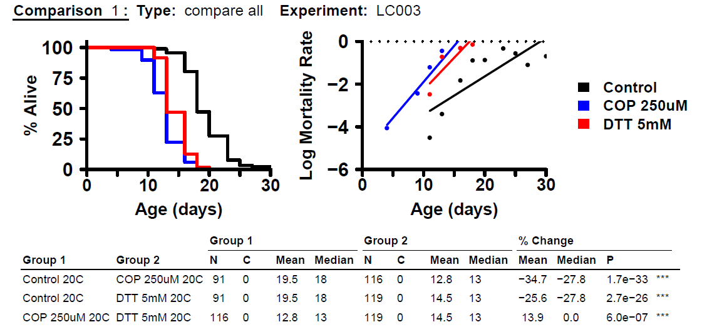

## Executive Summary

Bradford Hull is a 5th year PhD Student in Molecular and Cellular Biology. He is currently researching lifespans of Caenorhabditis elegans worms and the effects of  different stressors for worms living in different media. Part of his research goal is to perform statistical analyses to determine whether any of these stressors have significant effects on the lifespans of the worms, both within media (compared to a control) and between media for the same stressors. He is primarily interested in comparisons of the same stressors between media for his research.

By the time of our consultation, Bradford had already performed experiments and collected data for both agar and liquid media, using copper and DTT (dithiothreitol) as stressors. Due to some challenges unique to each media, he was not able to perform the same procedure to capture data for each media. 

Bradford was able to provide his data in Excel for our review. The agar media experiments were performed in a manner suitable for the framework of Kaplan-Meier and logrank test methods for lifespan analysis, which he has already successfully performed using the `survival` package in $R$. However, his data collection for the liquid media experiments required a different procedure that we determined was not suitable for the Kaplan-Meier analysis framework, and the desired statistical analyses would require a different approach.

*To be updated with summary details of our recommended approaches, and whether they will be able to accomplish all of his desired comparison*

## Detailed Summary

### Background

Bradford is seeking statistical consultation to help him determine how to adequately approach a statistical analysis for data which he has already captured from several experiments. His research intent is to study the effects of different stressors on the lifespans of worms living in different media, and to compare how the same stressors in different media can affect the lifespans of worms when prepared in different media. Ultimately this research should aid in generalizing protocol for research using Caenorhabditis elegans as test subjects.

During our consultation, he was able to describe in detail the procedures that were carried out.  First, agar experimental units were made by adding $N=40$ worms to 9 total agar culture dishes. Stressors, copper and DTT (dithiothreitol), were each added to three of the cultures so that in total there were three of each stressor, as well as 3 control cultures in agar media. The $N=40$ and three replicates were chosen based on a power analysis from within the MCB department, but no further details were provided.

Next, liquid experimental units were made by adding approximately $N \approx 5000$ worms to each of three replicate liquid reservoirs per stressor; in total there 9 liquid culture reservoirs were prepared. 

It is important to note that all worms were originally drawn from the same population batch of eggs, and that all experimental units were prepared at the same time (same day).

Ultimately, Bradford's goals for analysis are the following (in his words, taken from a follow up email statement).

+ "...determine if the liquid data can be fit into a K-M curve (and therefore be able to use the log-rank test on it)"
+ "...determine if liquid copper and DTT are different from liquid control"
+ "determine if lifespan reductions for both copper and DTT from goal 2 are different from lifespan reductions in the agar data"

The team agreed that our next steps would be the following.

+ Analyze whether the Kaplan-Meier (K-M) procedure is appropriate
  + Within media by stressor
  + Between media by analogous stressor
+ Determine what conditions need to be met for a valid K-M analysis, and if those conditions cannot be met, what approach do we recommend for analysis?

### Methods

The study began the day the experimental units were prepared, and all worms were alive at the start time step. At every time step (usually one or two days), all experimental units had data collected. However, the procedure for data collection was not the same between experimental units in agar media and units in liquid media.

#### Agar

At each timestep, each agar culture sample was able to be observed in its entirety, that is all of the original $N=40$ worms in each sample could be observed, and the number of dead worms were counted. In this sense, individual worms were tracked throughout each timestep of the study, which is an important condition for Kaplan-Meier lifespan analysis. It is worth noting that each of the three replicates are in separate plates, and no worms were able to escape. Each experimental unit's data was recorded until all worms in their respective units were deceased.

#### Liquid

Due to challenges with measurement/observation of the worms in liquid media, the experimental procedure did not allow for the observation of the same worms. At each time step, one sample of approximately $150\mu \text{L}$ was drawn from each separate replicate and raw numbers of dead/alive worms were assessed using special lab equipment. Each sample captured approximately 90 worms, and after data collection these worms were discarded. Each experimental unit's data was recorded until there were two consecutive measurements of all-dead worms.

### Results and Evaluation

Three separate full experiments using the 9 experimental units (three treatments and three replicates) were performed between January and June 2024. A new experiment wouldn't be started until a previous was completed, so there was no overlap between studies. Each experiment lasted approximately a month.

#### Agar

The experimental procedure for agar media captures time-to-event data (the event in question being death) for all individual worms throughout the length of the study. Observations were of the same individual worms in each experimental unit at every time step. Time steps were generally once every two days, excluding weekends, but in all cases all units were sampled at each time step. 

All experimental units were sampled until every worm was dead, and no worms escaped any of the experimental units, so there is no censoring of any of the subjects. This means that we have adequate conditions for a Logrank test, and we are able to use a simple Empirical CDF to visualize the survival functions. A Kaplan-Meier curve would only technically be necessary to communicate any censored data, so it is not necessary here (although visually very similar).

The analyses that Bradford performed of the data using the `survival` package in R are valid for comparisons between treatments within the agar media, however we should note that the assumptions should be confirmed by Bradford for validity.

+ All replicates have identical treatment conditions.
+ Survival times are independent between subjects.
+ Pooled analyses must maintain these same assumptions.

```{r, echo=FALSE, warning=FALSE}
library(knitr)
path = "C:/Users/Alex Salce/OneDrive/Desktop/School/Courses/2024 FALL SDS MS/STAT 688AB STATISTICAL CONSULTING/repo/statistical-consulting/Bradford Hull"
```

```{r figures-side, fig.margin=TRUE, fig.show='hold', fig.cap="Agar survival analyses", out.width="25%", echo=FALSE}
include_graphics("LCvA001survival.png")

include_graphics("LC004survival.png")
include_graphics("pooledsurvival.png")
```

#### Liquid

The experimental procedure for the liquid media does not capture time-to-event data as would be required for a similar analysis as the  agar media. This method uses a random sample draw from the experimental unit population without replacement at each time step, and can only observe the sampled worms at that time step. 

K-M and logrank test analyses require that experimental subjects all be observed from the beginning of the study until either a death or a censoring event. We can actually safely assume that worms that were alive at a sample have been alive for the length of the experiment, however we cannot say whether or not any of the sampled dead worms were alive at the previous time step. So, we cannot estimate the survival curve in the same manner.

There are also some considerations that we should understand about the experimental procedure. We had concerns of worms possibly decaying/dissolving before they could be sampled, if they died before they were sampled. Per Bradford, "...There was little to no degradation of dead worms and worms only eat bacteria, so once they died they just floated around and were able to be sampled until the end of the experiment". 

*likely need some more detail in this portion*

### Recommendations

#### Emperical CDF, Qualitative Anlaysis

#### Median lifespan comparisons (?)

#### Recommended further study with parameteric estimates (?)


### Appendix

#### Kaplan-Meier assumptions

+ 

