```{r setup, echo=FALSE}
knitr::opts_chunk$set(fig.pos = "H", out.extra = "", tidy.opts = list(width.cutoff = 60), tidy = TRUE)
```

## Executive Summary

Desiree Jones is a health educator in the College of Medicine at the University of Arizona. Her current work with a program partnering with community organizations aims to help create and administer effective cancer education about "cancer development, risk factors, healthy habits, and cancer prevention including cancer screening", for tribal communities. 

In efforts to develop this education, Desiree gave separate presentations to target demographics for each of five subjects, Men's cancers, Women's cancers, colorectal cancer, lung cancer, and skin cancers. After each presentation, the audience members were given a survey in response to the presentation subject matter. The survey prompts included questions for basic demographic information, Likert-scale responses related to feelings about presentation time and amount of information (3 responses), as well as Likert-scale responses (10 responses) intended to evaluate the effectiveness of the education.

She was able to collect responses for each presentation, varying from roughly 10 to 30 survey participants per presentation. The intent of the data is to gain insight into the effectiveness of each presentation based upon the responses to a selection of the Likert-scale questions. In particular, she is also interested in responses to questions concerning the likelihood of a participant seeking follow-up based on the presentation, and whether those participants had already gotten screenings previously.

*Since Desiree has already done qualitative breakdowns of responses, we recommend the following techniques and qualifiers to the data that she captured (TO BE UPDATED)*


In keeping with the limitations described in the questionnaire, these results are intended only for use by our community partner. They are not intended for research purposes or reports.


## **Detailed Summary**

### **1. Background**

Desiree is a health educator in University of Arizona's College of Medicine, and is seeking statistical consultation to gain insight about some survey response data that she has collected. She is working with a community partner to help them improve ways of administering cancer education to tribal communities.

Educational presentations were given to participants with information about "...cancer development, risk factors, healthy habits, and cancer prevention including cancer screening...".  The presentations separately covered each of five topics about different kinds of cancer.

- Men's cancers
- Women's cancers
- Colorectal cancer
- Lung cancer
- Skin cancer and Sun Safety

A survey corresponding to the presentation topic was administered to participants immediately following the presentation.

Desiree has already generated some graphical and qualitative insights with the data that she has captured. Based on our consultation, we intend to provide the following.

- Insight regarding the validity of the data and her approaches to communicating the results
- Whether there are any statistical methods that may be useful to her evaluation of the effectiveness of each presentation, and if there are any comparisons that may be useful. If so, what are they, and how those analyses can be produced with the data that she captured.
- Any advice on methods that may be helpful to communicating results, with the knowledge that she has limited experience in Excel and $R$.

### **2. Methods**

Each survey had the same general structure.  The first questions were to capture demographic information like age, gender assigned at birth, current gender identity, and race, and one additional question targeting whether the participant has received any previous screening for the type of cancer that was the subject of the presentation. These were "radio button" style responses, so the participant could only select one.  The next set of questions, 10 in total, were Likert-scale questions intended to evaluate the effectiveness of the presentation. Response options were 5 typical categorical options, Strongly Disagree / Disagree / Neither Agree or Disagree / Agree / Strongly Agree, and were prompts about whether the participant felt like they learned new information from the presentation, whether they would share information with others, if they would pursue follow up, and if they now knew how to do so, among other evaluations.

Lastly, each survey asked three questions with Likert-scale responses about whether the participant felt the length of activity, amount of information, and amount of time for discussion was too long, too short, or just right.  A freeform response section immediately followed, but will not be considered in any of our anlaysis.

In total, Desiree collected $76$ responses, with the following approximate breakdown.

- Women’s Cancers: 12 participants
- Men’s Cancers: 18 participants
- Colorectal Cancer: 6-8 participants
- Lung Cancer: 31 participants
- Skin Cancer: 12 participants

Details are not available about how the sample populations were selected. As such, we do not have any insight regarding randomness for the selection process, so we will not make any assumptions regarding the selection process for the attendees.

We have enough approximate sample size information to construct our own simulated data to use for analysis demonstration. The subsequent data presented are from a simulated dataset based upon her Lung Cancer participation numbers to avoid any use of potentially sensitive information.


```{r, echo=FALSE, warning=FALSE}
library(knitr)
library(formatR)
```


### **3. Recommendations for Anlaysis**

#### **Inference and Summary Statistics**

It is not recommended to perform any inferential statistics based on the data acquired and the overall goal of assessment of whether or not a presentation was effective. Given the nature of the data collected and small sample sizes, it will be sufficient to use qualitative approaches to gain insights regarding the effectiveness of the presentations.

Inferential statistics will be difficult to justify for comparisons between presentations due to required population independence assumptions. We are aware of some overlap between groups, which will violate assumptions for these comparison procedures. In any case, for the overall evaluation of effectiveness of each of the presentations on their own, inferential analysis should not add any meaningful value to evaluation of presentation effectiveness.

If any summary-style statistics are to be used for the Likert-scale responses, we recommend using *modes* (the most frequent response), *medians* (the mid-value of the set when all responses are ordered by scale), and *frequencies* (counts of each response) for responses. *Means* should be avoided, as the Likert-scale responses are *ordinal* data (have an order/ranking with unknown "distance" between values) and not continuous.

#### **Visualizations**

The visualizations that we were shown during the consultation are valid for communicating results. We have generated some simulated data that we use as an example to model some additional recommended approaches to data insights below.

##### **Excel Pivot Tables**

Excel has some worthwhile tools that may help in finding cuts of the data that may be useful in answering some questions. Namely, Excel's *Pivot Table* function serves as a useful way to build more specific insights from the full dataset.

Reference the accompanying file `Simulated_lung_cancer_data_31Participants.xlsx`.

To follow along with this tutorial, ensure that the data is organized in a fashion similar to the simluated data, or use the data as the example. 

----------------------

- Each row will correspond to a unique participant in the survey, and each column should correspond to a response in the survey. First, select all of the data on the sheet using `Ctrl+A`. To ensure there are no blank entries, use `Ctrl+H` to open the `Find and Replace` window. Leave the `Find what:` field blank, and type `Blank`, or some generic string, into the `Replace with` field. Click `Replace All` to replace all blank entries in the data with a string.

- While in the `Find and Replace` menu, you should also replace each of the Likert responses data entries to begin with a number, recommend $1-5$ for the `Strongly Disagree` to `Strongly Agree`, formatted like `4 - Agree` as an example. Repeat similarly, recommend $1-3$ for the `Too Short` to `Too Long` responses.


```{r fig.margin=TRUE, fig.show='hold', fig.align='center', fig.cap="Find and Replace blank entries (left), Find and Replace Likert entries (right)", out.width="40%", echo=FALSE}
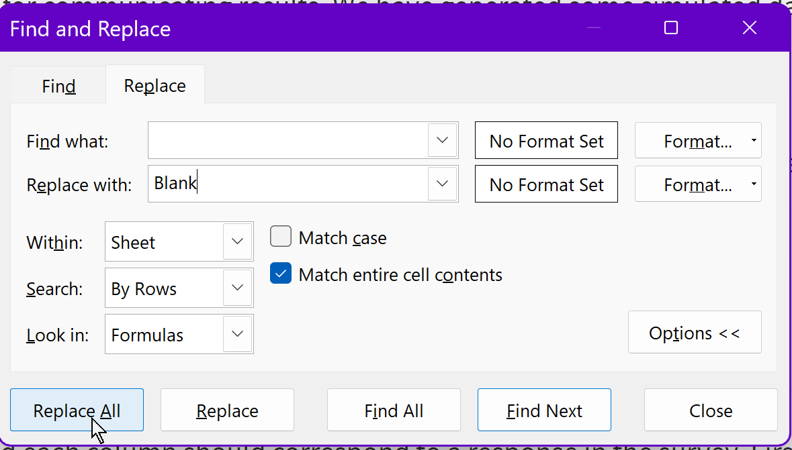

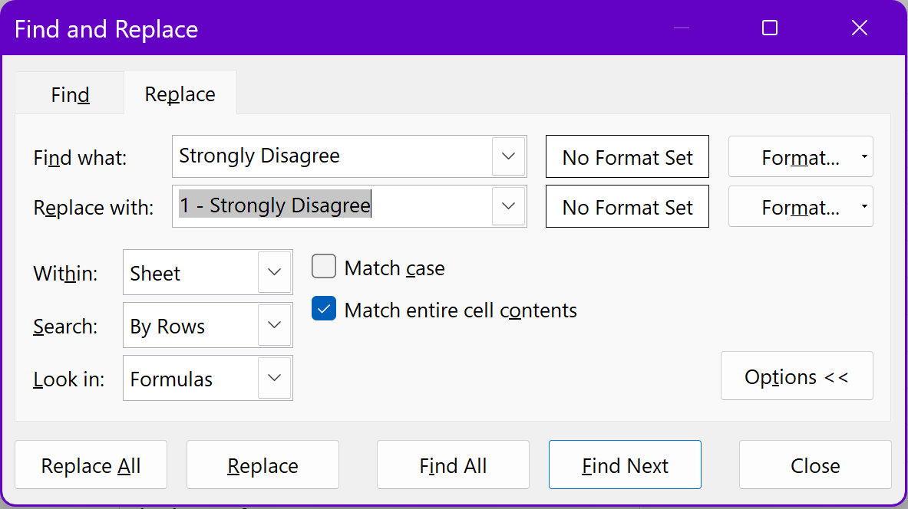
```
```{r fig.margin=TRUE, fig.show='hold', fig.align='center', fig.cap="Formatted data", out.width="40%", echo=FALSE}
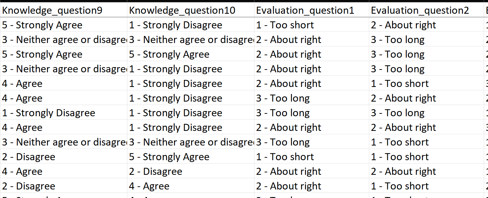
```

- Return to the sheet, and ensure all data is still selected, using `Ctrl+A` if it is not. On the Ribbon, navigate to the `Data` tab. Locate the `Get & Transform Data` group, and find the `From Table/Range` function. A `Create Table` dialog will appear. Ensure the cell ranges match your data ranges and that `My table has headers` is selected. This will bring up the `Power Query Editor` window.

```{r fig.margin=TRUE, fig.show='hold', fig.align='center', fig.cap="From Table/Range (left), Power Query Editor (right)", out.width="40%", echo=FALSE}
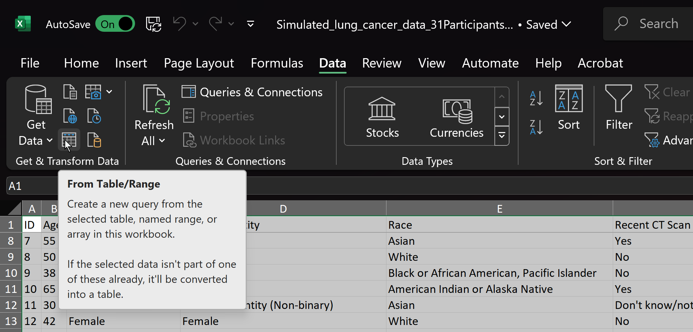
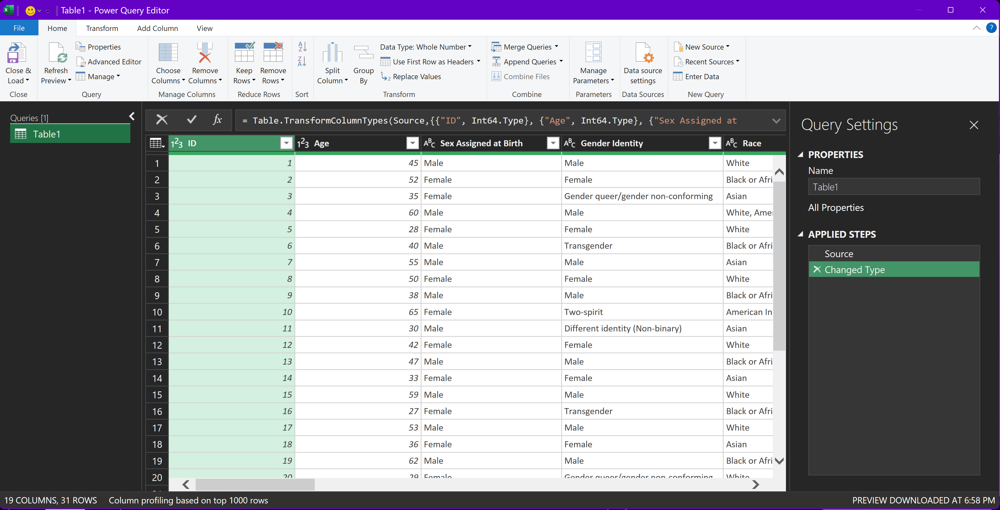
```

- Inside the `Power Query Editor` window, select the first column of the response data for the cancer knowledge questions (whose responses are `1 - Strongly Disagree` to `5 - Strongly Agree`), hold `Shift`, and scroll and select the last column of the cancer knowledge questions so that all columns of the cancer knowledge questions are highlighted.

```{r fig.margin=TRUE, fig.show='hold', fig.align='center', fig.cap="Select all cancer question columns", out.width="40%", echo=FALSE}
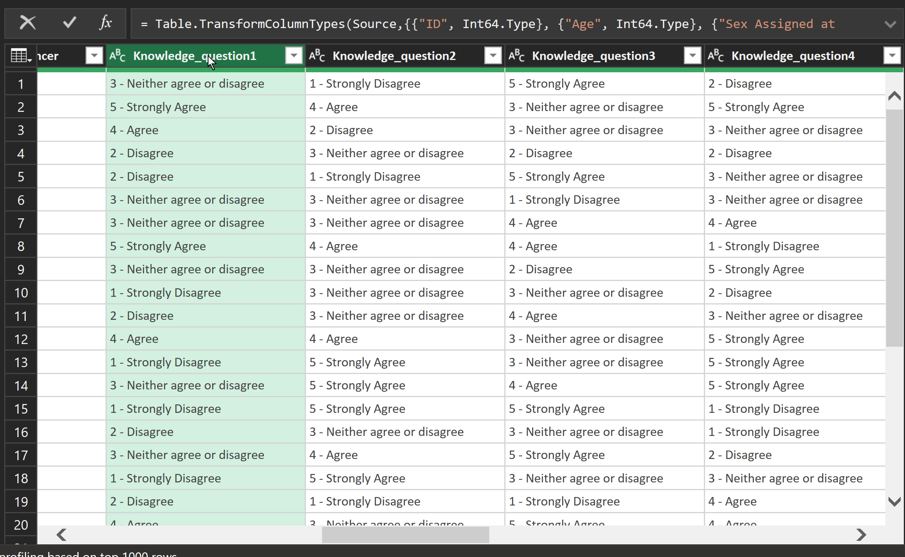
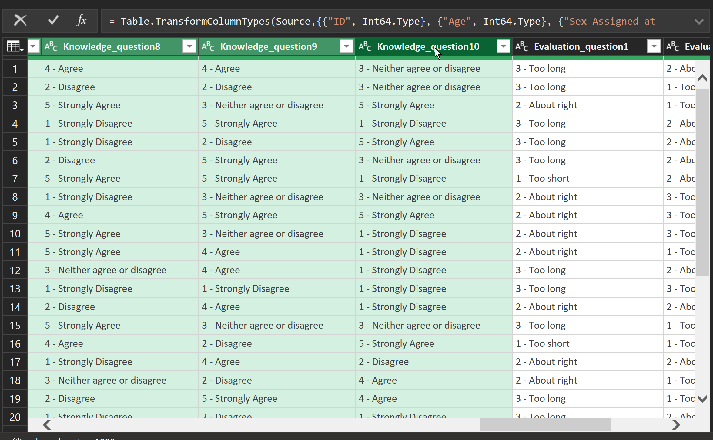
```

- Navigate to the `Transform` tab on the `Power Query Editor` Ribbon. Locate the `Unpivot Columns` drop down menu, drop and select `Unpivot Only Selected Columns`.  This will collapse the columns for each question down to rows for each participant/question/response. *Note* - if you need to undo the operation for any reason, use the `X` next to the operation under the `Applied Steps` menu on the right hand side.

```{r fig.margin=TRUE, fig.show='hold', fig.align='center', fig.cap="Unpivot columns", out.width="40%", echo=FALSE}
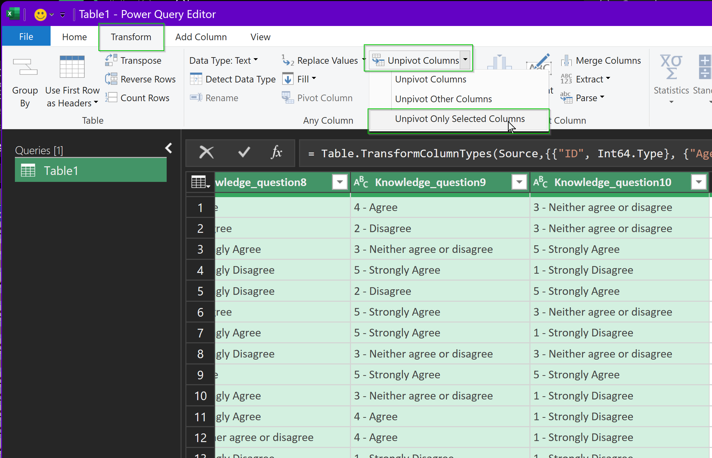
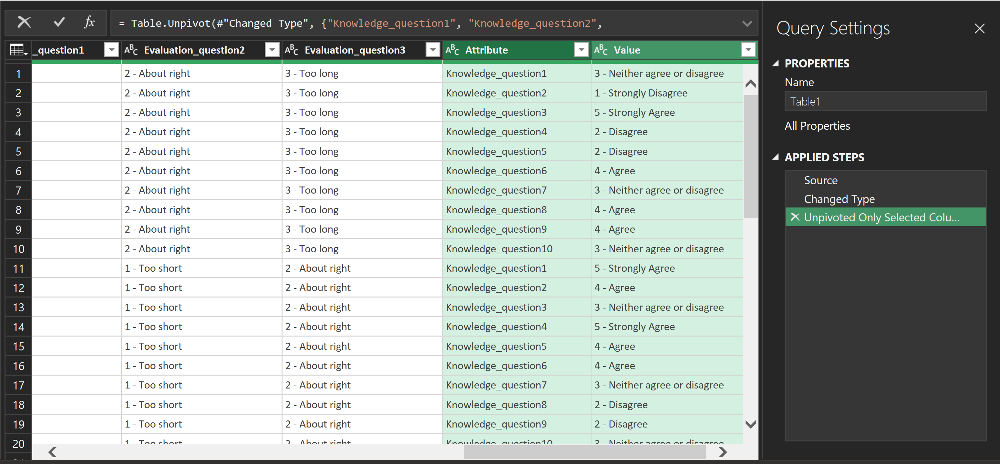
```

- Repeat this process for the responses about the presentation, ensuring this operation is done separately from the cancer knowledge questions. *Note* - these operations will only be done for the two Likert-response data portions of the survey.

- Rename the unpivoted columns by right clicking on the column name and changing the column names from `Attribute`, `Value`, `Attribute.1`, and `Value.1` to reflect which columns are cancer education questions/responses and which are presentation questions/responses per the image shown in the figure below.

```{r fig.margin=TRUE, fig.show='hold', fig.align='center', fig.cap="Both question sets unpivoted (left), Renamed columns (right)", out.width="50%", echo=FALSE}
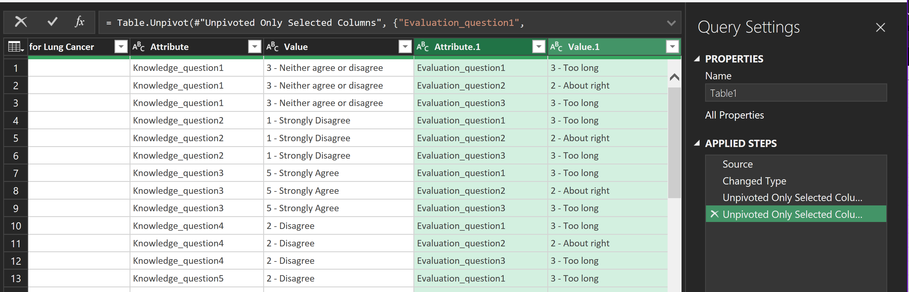
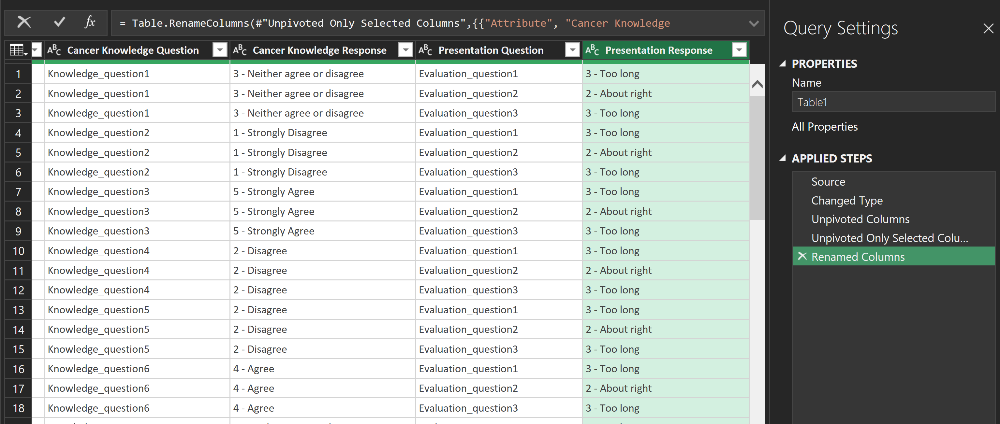
```

- Once complete, in the `Power Query Editor` click `File`>`Close & Load To`. On the `Import Data` prompt, select `PivotTable Report` and ensure `New worksheet` and `Add this data to the Data Model` are checked.

```{r fig.margin=TRUE, fig.show='hold', fig.align='center', fig.cap="Creating PivotTable from Power Query Editor", out.width="30%", echo=FALSE}
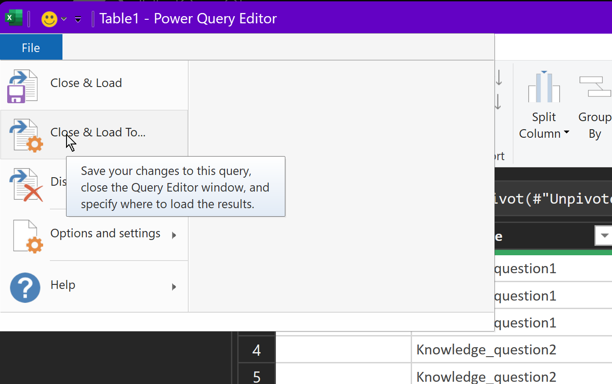
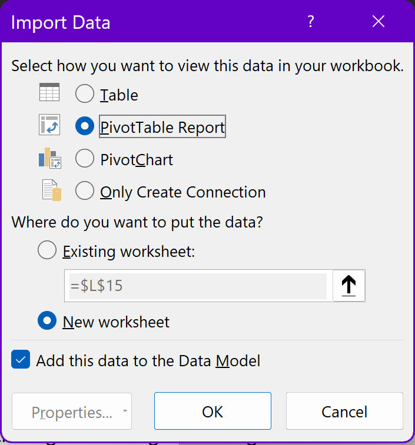
```

- A new worksheet will be created with a PivotTable field in the sheet as well as the `PivotTable Fields` menu expanding on the right, with four areas below that will help build our datasets: `Filters`, `Columns`, `Rows`, and `Values`. 

```{r fig.margin=TRUE, fig.show='hold', fig.align='center', fig.cap="New PivotTable", out.width="40%", echo=FALSE}
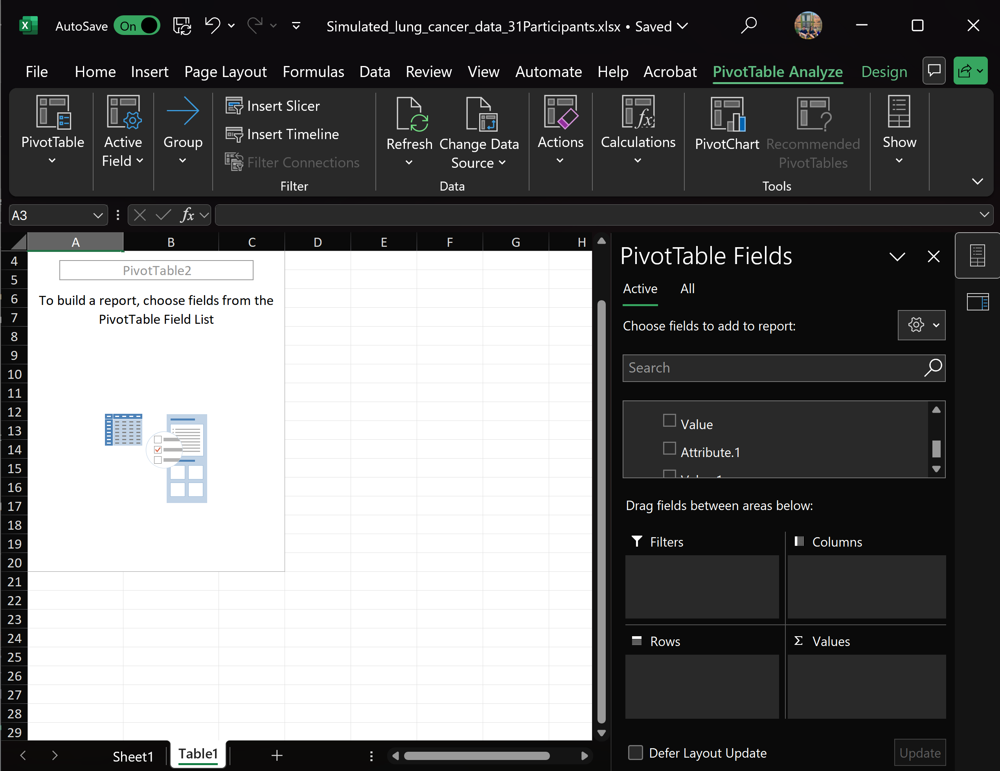
```


- To build a PivotTable for data of interest, we can scroll down to find the `Cancer Knowledge Question` field (or whatever was chosen when renamed) and drag it to the `Filters` area. This gives our PivotTable the ability to filter by each question in the cancer education portion. Next, we drag `Cancer Knowledge Response` (or whatever was chosen when renamed) and drag to the `Rows` area, which defines the table rows as the Likert-responses.  Then, grab the same `Cancer Knowledge Response` and drag to the `Values` area, where it will change name to `Count of Cancer Knowledge Response`, which populates the counts of each response in each table row. You should now see a table in your PivotTable area that summarizes counts of each Likert-scale response for responses to all 10 questions that can be filtered by question.

- We can also add additional filter criteria to the table, so we can add the responses to the demographic questions as well as the screening question as filters. The data can be filtered using the drop downs in each filter row at the top. In the second image below, we have filtered data to only those who answered "No" on the screening response question.

```{r fig.margin=TRUE, fig.show='hold', fig.align='center', fig.cap="Cancer Education Questions PivotTable", out.width="40%", echo=FALSE}
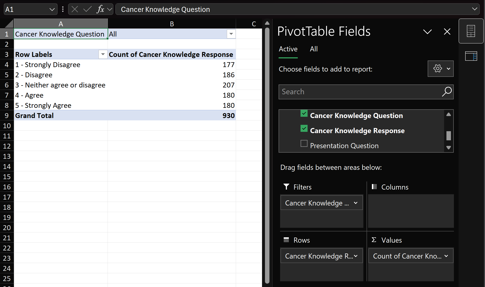
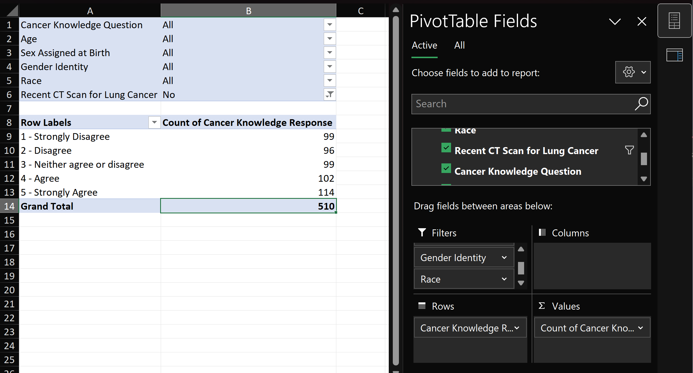
```

- We can also add PivotCharts, which will give us visualizations of our data from the PivotTable that update as we filter and modify the PivotTable. Insert a PivotChart from the `PivotTable Analyze` tab on the Ribbon.

```{r fig.margin=TRUE, fig.show='hold', fig.align='center', fig.cap="Create PivotChart", out.width="70%", echo=FALSE}
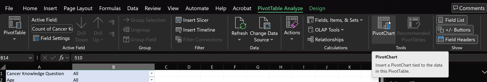
```

- Select a style you would like. Below is a radar chart of the filtered data. You can edit the data filters directly on the PivotChart itself.

```{r fig.margin=TRUE, fig.show='hold', fig.align='center', fig.cap="Create PivotChart", out.width="40%", echo=FALSE}
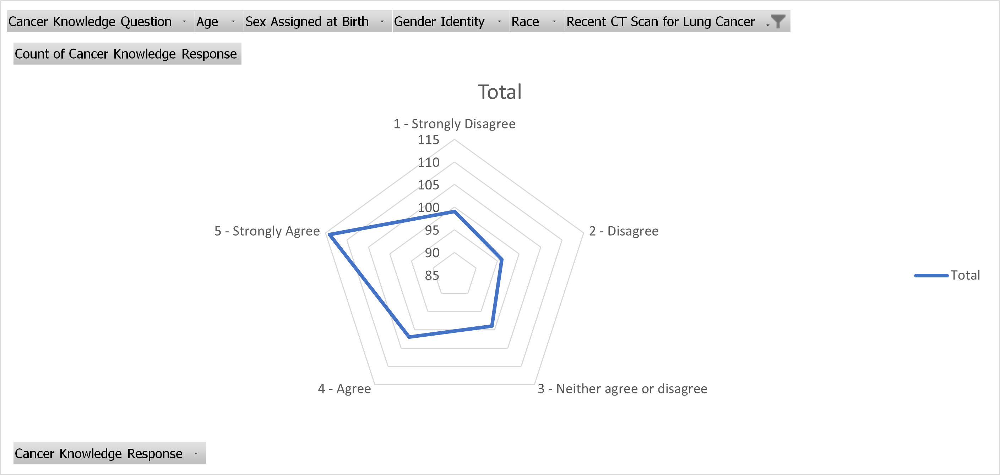
```

There are many different aspects of the data that can be generated using PivotTables and PivotCharts by rearranging different combinations of fields in each area, as well as filtering data based on other responses like demographic information.

#### **Participant Sampling**

It is important to be considerate of possible biases that may exist based on how participants came to attend the presentations. Considerations like time of day, location, whether they selected or volunteered for the presentations are the types of considerations that may be worthwhile to review to ensure the target population is captured (if those considerations have not already been taken into account). The demographic data should help to visualize some of the possible biases, if they exist or are relevant to the evaluations.

### **4. Recommendations for Data Communications**


In keeping with the limitations described in the questionnaire, these results are intended only for use by our community partner. They are not intended for research purposes or reports.

Based upon the statements in the surveys that were given,

\[
\textit{"The information will not be used for clinical or research purposes."}
\]

we advise that none of these results be presented in any research, including MS or PhD dissertations, or work intended to be published, despite IRB-exempt status.


### **Appendix**

#### **1. **
Lorem Ipsum

#### **X. R code, Tools, Other**

----------------------------------------

```{r setup_environment, message=FALSE, tidy=TRUE, tidy.opts=list(width.cutoff=60), warning=FALSE, eval=FALSE}


