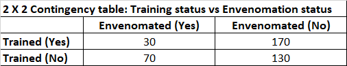
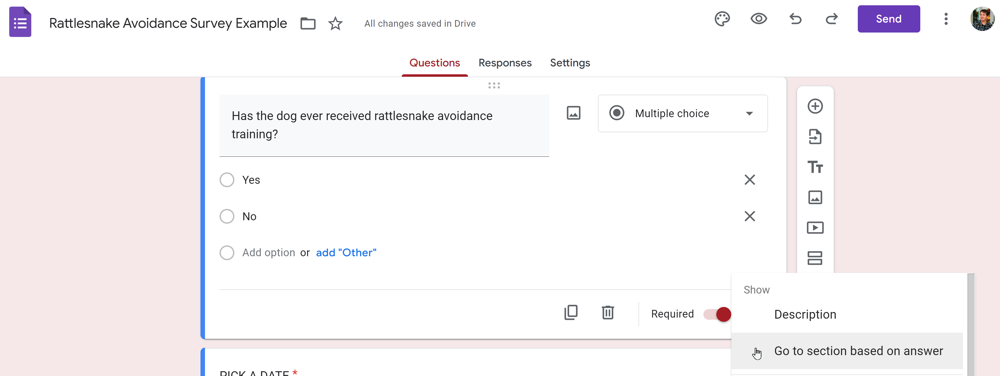

```{r setup, echo=FALSE}
knitr::opts_chunk$set(fig.pos = "H", out.extra = "", tidy.opts = list(width.cutoff = 60), tidy = TRUE)
```

```{r, echo=FALSE, warning=FALSE}
library(knitr)
library(formatR)
```

## Executive Summary

Sarah Carotenuto DVM, DABVP (CF) is an Emergency Veterinarian and an assistant professor at the College of Veterinary Medicine with the University of Arizona. She is currently working with Cody Will to study the effectiveness of rattlesnake avoidance training in dogs. Cody is the founder and trainer at Rattlesnake Ready, LLC (RR), which specializes in this training. They intend to capture data to support quantification of the effectiveness of rattlesnake avoidance training, citing costly and traumatic consequences for dogs and owners who suffer envenomation from a rattlesnake during an encounter.  There is currently no published, peer reviewed data that is available to support their investigation. 

During our consultation, we determined that initial steps should be taken to capture interpretable data that can later be used to help quantify rattlesnake avoidance training effectiveness for dogs who have had real encounters. Sarah and Will had originally drafted two surveys that the consultation team referenced to evaluate what kinds of responses would be reasonable to capture. One survey was tailored to be sent out to Will's previous clients, and the other was tailored for owners visiting an emergency clinic for an envenomation incident. The consultation helped to determine next steps for Sarah and Cody to start capturing data to help quantify the effectiveness of training, noting that there are other training methods available than what is administered at RR.

The consultation team first recommends use of only one version of the survey, and that it be written in a generic way such that a participant can be any dog owner. In general, the survey should minimize the use of open-form questions and use questions with mutually exclusive closed-ended questions. The data that is captured from this survey will ultimately be used to statistically evaluate the null hypothesis "There is no difference in the proportion of snake bites during encounters between dogs that have received rattlesnake avoidance training and those that have not." This format should allow use of a chi-squared test of independence to assess the hypothesis once data is collected.

Once a draft of the survey is complete, a small pilot should be run to ensure that participants can complete the survey as expected, and to identify any possible edits prior to deployment.

We want the survey to be written generically so that we are not restricted in who is able to take the survey, and we should not limit participants to only those who are known in advance to have experienced the event of interest (envenomation). For example, if participants are to be surveyed through the clinic, the participants should not be limited only to envenomated dogs receiving treatment. Rather, all willing participants at the clinic should be surveyed, as it will provide a better random sample of the population of dogs included in the analysis. We should aim to capture total of at least $n=100$ participants each from trained and untrained, all of whom have had an encounter with a rattlesnake.

We advise that appropriate steps are taken with IRB to ensure the methods of administrating the survey are approved. This includes Cody's clients, as well as owners of dogs admitted to the clinic. 


## **Detailed Summary**

### **1. Background**

Sarah Carotenuto DVM, DABVP (CF) currently works as an Emergency Veterinarian at Veterinary Specialty Center of Tucson, and regularly sees dogs who have been envonomated by rattlesnakes admitted to the clinic. Having seen these incidents firsthand, she has professional insight into the trauma and financial duress that is experienced for dogs and owners during these visits. Consequently, she has a vested interest in rattlesnake avoidance training for dogs and investigating whether getting a dog training is effective in mitigating envenomation incidence.

There is currently no data available publicly or via publication that may help in attesting to the effectiveness of and rattlesnake avoidance training methods, so Sarah has teamed up with Cody Will to start collecting supporting data. Cody is the founder and trainer at Rattlesnake Ready, LLC (RR), where he performs rattlesnake training for over 1,000 dogs per year. His methods of training are unique to his practice, and he and Sarah have acknowledged that there is no standardized training that occurs between all services that are similar to Cody's.

Cody has not collected data pertinent to training outcomes, but he does have demographic and contact information for all dogs and owners he has seen previously. Sarah may have access to some data through the clinic, but nothing that will be of immediate use in their study. This has motivated the need to collect usable data for their study by other means, and they determined it would sensible to collect data via survey. They drafted two surveys from what they believed would be sample populations of interest: owners who have used Cody's training services for their dog, and owners who visit the clinic for envenomation incidence at either of two local emergency hospitals in Tucson to use as a control group. The consultation team has used these surveys as reference for the recommendations outlined in this report.


### **2. Methods**

*An overview of the contents of each survey and question design*

- **Survey 1** *Dogs who have undergone rattlesnake aversion training*

Survey 1 is tailored to a population of dogs that have undergone training, and is intended to be sent Cody's previous clients. 

The survey opens explaining to the participant that they have participated in RR training and "University of Arizona College of Veterinary Medicine is conducting a survey of owners", and that they will be entered in a drawing for a gift card for their participation. 

The survey first gathers demographic information about the dogs like age at time of training and age now (chosen from a list), how many times they have taken training, and what area are they currently living (suggested responses/free-form).

Question 1 asks whether the dog has had a rattlesnake encounter since training, and some follow-on questions conditioned upon whether they have or have not. The questions are a mix of free-form response, closed-ended response, and Likert-scale, and pertain to describing the encounter if they have had one, or level of confidence that their dog would avoid a rattlesnake if they had not.

Question 2 asks whether the dog has been envenomated by a ratlesnake since training. If so, whether the bite was accidental, provoked, or unknown (closed-ended response) and the approximate cost of treatment (open-ended).

Questions 3 and 4 ask why the owners were motivated to pursue the training (closed-ended response from a list), and whether the dog was interested in the rattlesnake when they first started training (free-form response).


- **Survey 2** *Envenomated dogs who have sought care at a local emergency practice*


Survey 2 is tailored to a participants with dogs that have been admitted at an emergency clinic. 

The survey opens with a similar statement as Survey 1, including the entry for a gift card for their participation. The same demographic information is gathered as Survey 1.

Additional questions include the location of the rattlesnake encounter (choose from a list or free-form) and whether the animal survived the envenomation.

In general, the surveys utilize a mixture of types of responses and allow the participant some freedom in how they respond to certain questions. These questions are a great start for formulating an effective survey, and we will leverage their ideas for our recommendations.


### **3. Recommendations**

#### **Problem Statement Mapping to Hypothesis Test**

In order to establish the kind of data we will want to capture with surveys, we should first map our problem statement to a null hypothesis that we can later use to perform statistical analysis, once data is available. 

Our general problem statement: *"Is  rattlesnake aversion training is effective in reducing envenomation incidence for dogs who have at least one encounter with a rattlesnake."* 

We construct a null hypothesis statement from this statement, for which we can determine the population and data we need to capture to support this hypothesis or "reject" it.

- $H_0$: *There is no difference in the proportion of snake bites during encounters between dogs that have received rattlesnake avoidance training and those that have not.*

The "alternative" hypothesis is then formulated as:

- $H_1$: *There is a difference in the proportion of snake bites during encounters between dogs that have received rattlesnake avoidance training and those that have not.*

If we "reject the null" hypothesis $H_0$, we will accept the "alternative" hypothesis $H_1$, and vice versa if we accept the null.

This will be our primary motivation for how we construct survey questions and possible responses. We will keep in mind additional data we may want to capture that may not directly support the evaluation of the hypothesis, but would be useful for future insights based on our consultation.


#### **Single Survey and Considerations**

We recommend that only one survey be created, and subsequent recommendations for survey questions will be applicable to any dog owner regardless of population from which they are sampled. Screening questions can be utilized to characterize the sample and determine the population without any need to screen in advance. 

In general, we want to keep the data that we capture as simple as we can, and limit the number of possible responses wherever we can.  We will prioritize using closed-ended questions, and limit the scope of each question to one concept. Since this will be the first version of a survey we may later wish to expand, we should formulate questions that can be reused on subsequent versions. The responses to these questions should leave room for possible additional response options, as opposed to needing to change any of the response options for any future updates to the survey. 

When formulating our questions, we want to tailor them to be scalable to other problems we may be able to better study in the future. For example, during the consultation we discussed that there are different methods of rattlesnake aversion training available, and that it may be of interest to compare the effectiveness of these methods to each other. We determined that this would not be a question that we can feasibly answer in the short term, but if we include questions now in a format that captures this kind of categorical information sensibly in the survey, we can reuse the same survey questions for future study, as well as the data that was captured in the short term without any modifications.

Questions we use should also be formulated in simple and neutral terms to avoid any biases in the responses. This survey may be given to participants that are or have recently been under emotional and/or financial distress, so the questions and any options for responses should be considerate of the participant's possible emotional states.

Ordering of questions will also be an important consideration. The questions should follow logically and start broadly, leading into any subsequent questions that may be conditional on a previous response. If the subsequent question may not be applicable based upon a previous response, add a "Not Applicable" response option, or something similar.

Lastly, we should limit questions to as few as necessary for our purposes to minimize time and information needed for participants to complete.

#### **Survey Questions**

Based on the consultation, we recommend survey questions that are tailored based upon the following.

- Demographic Data

  - *Date and Location of Participant*: Select date and radio button for location participant is taking survey. **Example:** *Clinic*, *Home*, *Other*. Actual options are left to the discretion of expert.

  - *Age of dog*: A number in years is acceptable, but a drop-down list or radio button of age range is also acceptable to keep simple and limit possible responses. Ideally, this would follow some kind of standard if available. **Example:** *0-1 years*, *1-2 years*, *2-3 years*, *Over 3 years*. Actual options are left to the discretion of expert.
  
  - *Gender*: Simple drop-down list or radio buttons.
  
  - *Breed/Type*: Radio buttons with limited options is preferred to limit possible responses. An "Unknown" and "Other" can be used in this case. "Other" may be left as a free-form response. Actual options are left to the discretion of expert.
  
  - *Area dog is currently living*: A limited number of sensible/generalized radio-button responses (examples in provided survey are good), with a free-form "Other" field.
  
- Training Screening

  - *Has the dog ever received rattlesnake training?*: This is a key question for the hypothesis test. Yes/No radio button. Remaining questions in this section are only required if this question is answered "Yes". Consider a statement like "If you have answered "No", proceed to next section". Alternatively, if the survey service has an option to omit questions or automatically answer based on this response, consider utilizing the feature.
  
    - *How many times has the dog received rattlesnake avoidance training?*: Drop-down list or radio button, **Example:** *1*, *2*, *3*, *4 or more times*. Actual options are left to the discretion of expert.
    - *How long has it been since training was last received?*: Drop-down list or radio button, **Example:** *<1 year*, *1-2 years*, *2-3 years*, *>3 years*. Actual options are left to the discretion of expert.
    - *Where was the most recent training conducted?*: Drop-down list or radio button, include Rattlesnake Ready as well as any other known services in the areas specified in the "Area currently living" responses. Actual options are left to the discretion of expert. Provide a free-form "Other" response field.
    - *Any additional comments about your experience with rattlesnake avoidance training (optional)*: A free-form response that can be included as optional for the participant. This will only be used to capture any anecdotal testimonials about their dog's training experiences.

- Encounter and Envenomation Screening

  - *Has your dog ever encountered a rattlesnake?*: This is a key question for the hypothesis test. Yes/No radio button. Remaining questions in this section are only required if this question is answered "Yes". Consider a statement like "If you have answered "No", proceed to next section". Alternatively, if the survey service has an option to omit questions or automatically answer based on this response, consider utilizing the feature.
  
    - *Had your dog received rattlesnake avoidance training prior to the most recent encounter?*: Yes/No radio button. We want to be sure of the state of the dog's training during its most recent encounter. For statistical analysis of the hypothesis test, we will be dismissing any prior encounters due to complications related to independence of the samples; we cannot use the same dog's previous encounter data.
    - *Was your dog envenomated (bitten) by the snake during this most recent encounter?*: This is a key question for the hypothesis test. Yes/No radio button.
    - *Where was the encounter?*: We may be interested in some detail about the environment. To control the types of responses, use a checkbox-style list with various descriptors. This provides categorical information while limiting response types. Limiting available categories here can be important to future analysis, like if we are later interested in identifying circumstances with higher risk for envenomation than others. **Example:** *At or near home*, *Near wash or river bed*, *Hiking*, etc. Actual options are left to the discretion of expert. Provide a free-form "Other" response field.
    - OPTIONAL: *Has your dog had any previous encounters? If so, how many? (optional)*: Two sub-questions
      - *Prior to training*: Radio button or drop-down list **Example:** *1*, *2*, *3*, *3+*.
      - *Number of incidents of envenomation*: Radio button or drop-down list **Example:** *1*, *2*, *3*, *3+*.
      - *After training*: Radio button or drop-down list **Example:** *1*, *2*, *3*, *3+*.
      - *Number of incidents of envenomation*: Radio button or drop-down list **Example:** *1*, *2*, *3*, *3+*.
    - OPTIONAL: *Any additional information regarding this encounter and/or other encounters (optional)*: A free-form response that can be included as optional for the participant. This will only be used to capture any anecdotal testimonials about their dog's encounters.
    - **Additional notes for this section**: Unless it is necessary for other reasons, we recommend omitting questions regarding the financial impacts of treatment, whether the bite was accidental or provoked, and whether the dog survived the bite, as they won't be needed for our analysis and may be sensitive information to the participant.
 
Additional questions to capture any other desired data may be added at the discretion of the experts. These should be added carefully to minimize time/information required from the participant.

#### **Survey Population Sampling Considerations, Calculations**

##### **Sampling**

During consultation, we covered proposed populations of participants for sampling. We are interested in capturing participants who meet the conditions of each population of interest (dogs who have had a rattlesnake encounter, of which dogs who have and have not had training), and from these populations we need to capture a *random sample* of outcomes. So we should not deliberately seek dogs who have been envenomated, as this is the outcome of interest. Randomization of our sampling is an important condition to be able to justifiably perform statistical analysis.

This should not present an issue if we survey previous customers of RR, as long as there is no biased selection in who is sampled. However, if we sample at the clinic, we will not want to limit participants to only those who are admitted for envenomation. Rather, we should survey all patients that willing to participate. In each of these cases, we are sampling from populations that we must assume are at least approximately representative of the larger population of dogs that have had snake encounters. For our small-scale purposes, we should acknowledge the limitations of participants we are able to sample, and that we may have some unavoidable biases in our data.

##### **Calculations**

Revisiting our hypotheses,

- $H_0$: *There is no difference in the proportion of snake bites during encounters between dogs that have received rattlesnake avoidance training and those that have not.*


- $H_1$: *There is a difference in the proportion of snake bites during encounters between dogs that have received rattlesnake avoidance training and those that have not.*

Once we have captured sufficient data, we will create a "contingency table" for our results to be associated with the test of this hypothesis. Most documentation on a chi squared test of independence will utilize contingency tables. Below is an example contingency table using some synthetic data.

```{r fig.margin=TRUE,fig.cap="Example Contingency Table", out.width="50%", fig.align='center', echo=FALSE}

```

What we are evaluating statistically, in simple terms, is if training actually *affects* the rate of envenomation for dogs who have a rattlesnake encounter with statistical significance. *Affects* does not necessarily imply *improves*, but the data itself will make clear how envenomation is affected between trained and untrained, if it indeed is. The analysis should be suitable for a chi squared test for independence (or potentially Fisher's Exact Test, depending on sample size).

In general, we want to capture as large of a sample size as possible. As a general rule of thumb, we hope to capture at least $n=100$ participants each from trained and untrained, all of who have had an encounter with a rattlesnake. However, more data is always welcome. If modest response numbers are difficult to obtain, risk-odds ratios can be compared for approximate comparisons, or Fisher's Exact Test may be able to provide statistical results for small sample sizes. 

We will not be able to assess the power of the test until after the data is collected, but the generally accepted standard of a power of $0.8$ may not be attainable for this study. Based on approximate calculations the required sample size could be anywhere from $200$ to over $2000$ participants (see Appendix). Any analysis that is performed should establish an awareness of this limitation due to the nature of the data and means for data capture.


#### **Survey Tools**

We recommend online survey tools be used to create a standard survey that automatically populates data as it is submitted.

- [Google Forms](https://www.google.com/forms/about/)
- [Survey Monkey](https://www.surveymonkey.com/)

Be sure to utilize functionality mentioned in the [Survey Questions](#survey-questions) section. An example from Google Forms constructing a "Required" question with radio buttons and an "Other" option that will go to a section based on an answer is shown in the figure below.

```{r fig.margin=TRUE,fig.cap="Google Forms Survey Example Question", out.width="50%", fig.align='center', echo=FALSE}

```

#### **Additional Recommendations**

- We advise to run a small-scale pilot of the survey before scaling up to be sure you do not have any issues with responses. This can be with anyone, and the intent is only to identify any issues with the survey like readability, time to complete, and that all questions make sense to anyone who may take the survey.

- We advise that steps are taken with IRB to ensure the methods of administrating the survey are approved. This includes Cody's clients, as well as owners of dogs admitted to the clinic and any other candidate participants.

### **4. Recommended Further Study**

The data and analysis that can be captured in this initial study should provide approximate insights that can aid in determining a path forward a for further and potentially more detailed study. Subsequent analysis of the data captured in this study should still take care to evaluate the data as it is captured before proceeding with the recommended analyses. Ensure that all detail regarding the data, methods of collection, and available participant information is evaluated by the team tasked with data analysis.

RR should consider the feasibility of additional data that may be captured during clients' visits, including any performance data of dogs for any initial evaluations that are performed. Additionally, performance data of any subsequent follow-up as well as the time elapsed since the previous training could be of use.

## Appendix

### Power of a Test

The "power" of a statistical test is a measure of probability that the test correctly rejects the null hypothesis, and avoids a Type I error. Type I error is an error that rejects $H_0$, and accepts $H_0$, when in reality $H_0$ is true. Power will increase as sample size increases, and in the case of a chi squared test of independence, it will also depend on "Cohen's $w$". We are only able to estimate Cohen's $w$, but it's influence depends on the overall proportions we may see in the categorical results. The generally agreed upon adequate level of power for a test is $0.8$ (which can be viewed as "analagous" to an $\alpha$ level of 0.05).  Approximate estimates of sample size were computed using below $R$ code.

```{r }
library(effectsize)
library(pwr)

# "Small" effect chosen for w
pwr.chisq.test(w = 0.2, df = 1, sig.level = 0.05, power = 0.8)

# calculate w from simulated contingency table
contingency_table <- data.frame(c(3,75),c(15,200))
cohens_w(contingency_table)

# Usin simulated w to determine sample size
pwr.chisq.test(w = 0.06, df = 1, sig.level = 0.05, power = 0.8)


```


